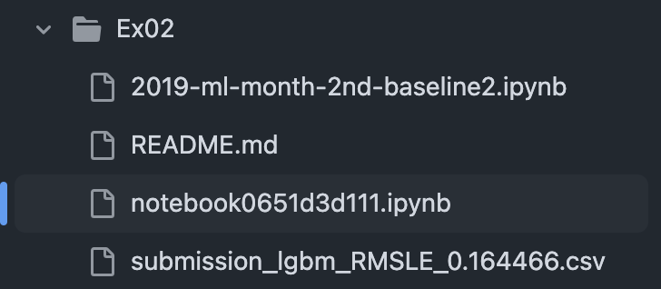
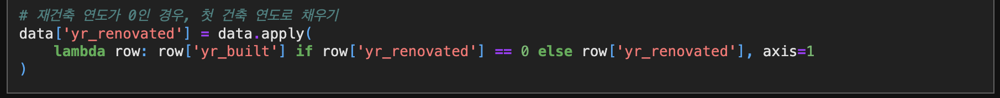
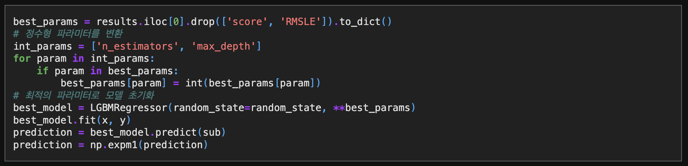
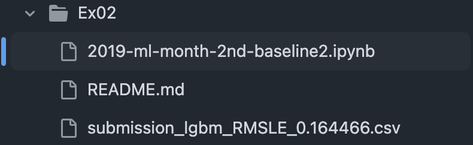
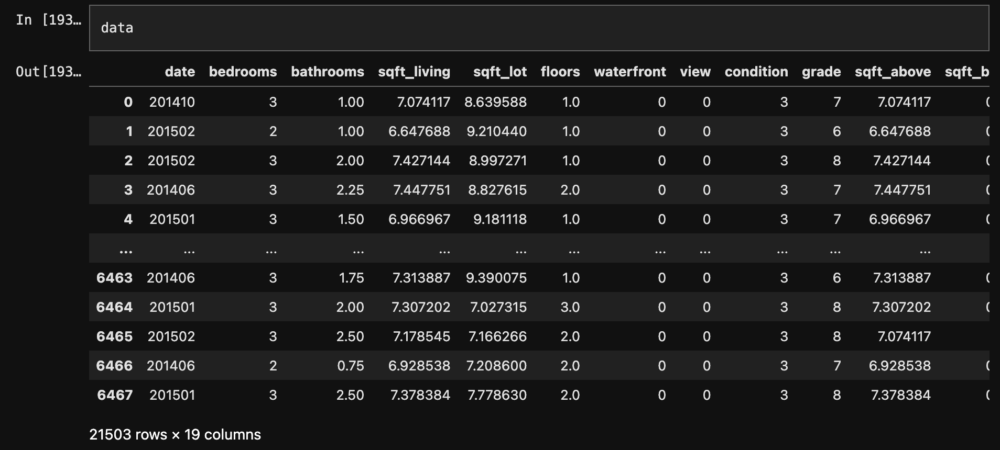
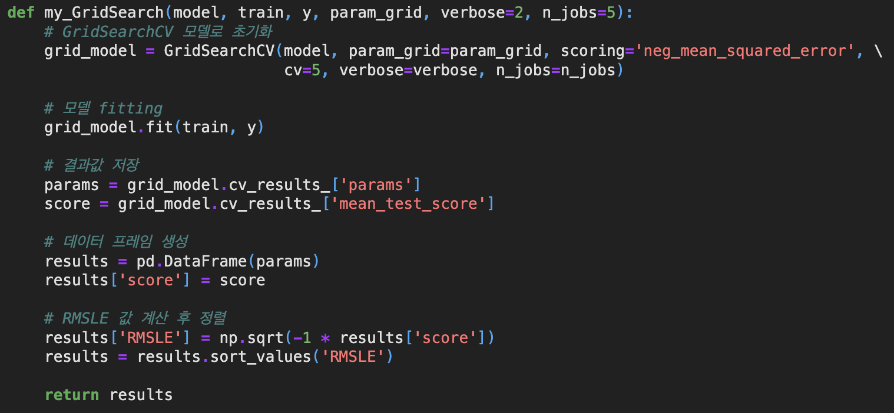

# AIFFEL Campus Online Code Peer Review Templete
- 코더 : 노규범
- 리뷰어 : 홍예린


# PRT(Peer Review Template)
- [x]  **1. 주어진 문제를 해결하는 완성된 코드가 제출되었나요?**
    - 주어진 데이터와 베이스라인을 활용하여 집 가격을 예측하는 코드를 작성.
    
    
- [x]  **2. 전체 코드에서 가장 핵심적이거나 가장 복잡하고 이해하기 어려운 부분에 작성된 
주석 또는 doc string을 보고 해당 코드가 잘 이해되었나요?**
    - 데이터 전처리 부분을 이해하기 쉽게 주석으로 설명.
        - 재건축 연도 column을 재건축 여부 0과 1로 판단
        
    - 성능이 제일 좋은 파라미터를 고르는 부분의 주석.
      
        
- [x]  **3. 에러가 난 부분을 디버깅하여 문제를 해결한 기록을 남겼거나
새로운 시도 또는 추가 실험을 수행해봤나요?**
    - 프로젝트 해결을 위해 계속 실험 중.
      - 전
        
      - 후
        
        
- [x]  **4. 회고를 잘 작성했나요?**
    - 중간 중간 데이터를 찍으며 이해를 도움.
    
        
- [x]  **5. 코드가 간결하고 효율적인가요?**
    - 중복이 될 수 있는 부분을 함수화하여 간략히 표현
    


# 회고(참고 링크 및 코드 개선)
```
- 필요한 데이터에 대하여 적절한 분석과 전처리!
- 근거를 확실하게 주석으로 작성!
- 따로 개선할 부분이 없음!
```
