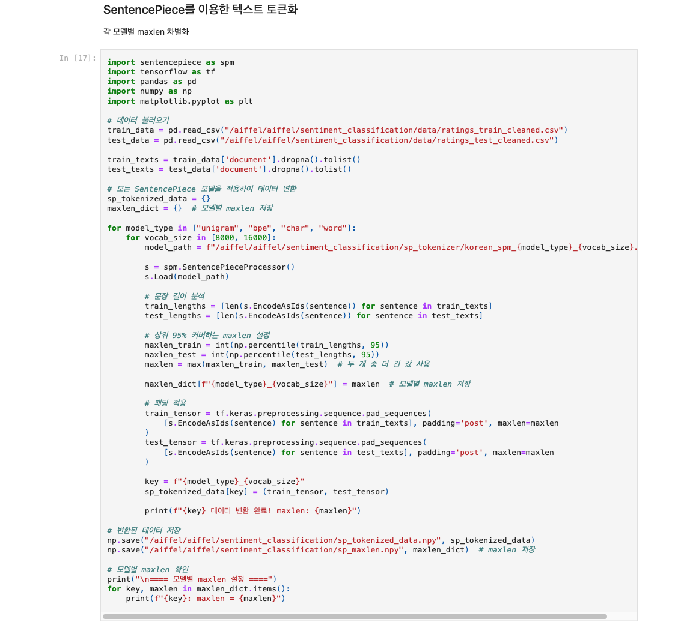
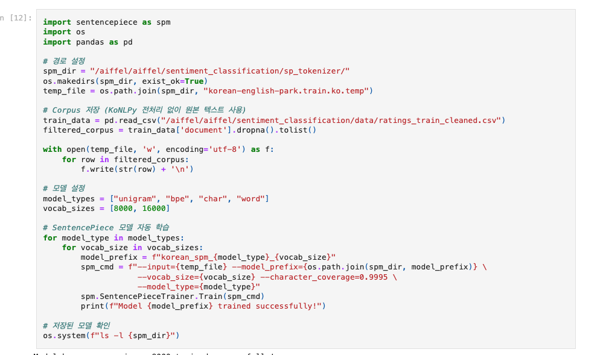
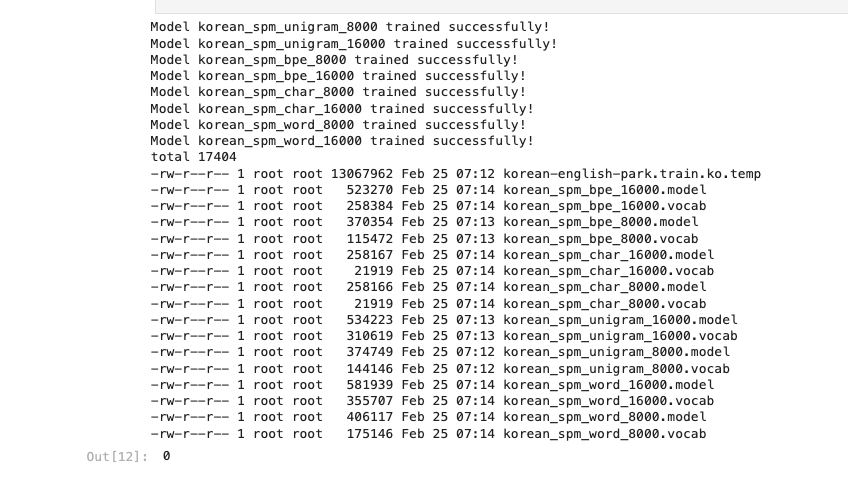
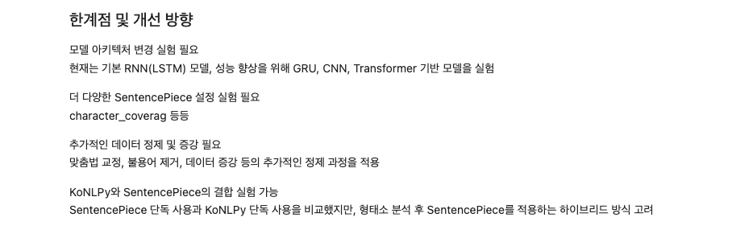
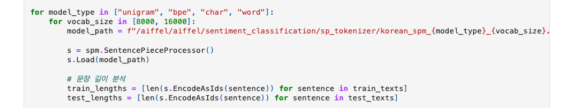

# AIFFEL Campus Online Code Peer Review Templete
- 코더 : 노 규범
- 리뷰어 : 김 영만


# PRT(Peer Review Template)
- [*]  **1. 주어진 문제를 해결하는 완성된 코드가 제출되었나요?**
    - 코퍼스 분석, 전처리, SentencePiece 적용, 토크나이저 구현 및 동작이 빠짐없이 진행되었습니다.
        - 
    
- [*]  **2. 전체 코드에서 가장 핵심적이거나 가장 복잡하고 이해하기 어려운 부분에 작성된 
주석 또는 doc string을 보고 해당 코드가 잘 이해되었나요?**
    - SentencePiece 모델 학습 하는데 다양한 옵션을 설정하여 효과적인 모델을 만드는데 필요한 부분에 대해 설명해주셨습니다.
        - 
        
- [*]  **3. 에러가 난 부분을 디버깅하여 문제를 해결한 기록을 남겼거나
새로운 시도 또는 추가 실험을 수행해봤나요?**
    - 환경 제약에 따른 부분을 해결 하기 위해 시도한 부분이 좋았습니다.
        - 
        
- [*]  **4. 회고를 잘 작성했나요?**
    - 진행하면서 느낀 한계점과 더 진행 할 내용을 잘 정리 했습니다.
        - 
        
- [*]  **5. 코드가 간결하고 효율적인가요?**
    - 다양한 케이스를 for문을 이용하여 간결하게 작성 되었습니다.
        - 


# 회고(참고 링크 및 코드 개선)
```
환경 제약 조건에도 불구하고 그에 대처하여 프로젝트를 잘 진행 하신 것이 좋았습니다.
그리고, 프로젝트에서 요구한 모든 부분을 완료 하려고 한 것 또한 좋았습니다.
```
